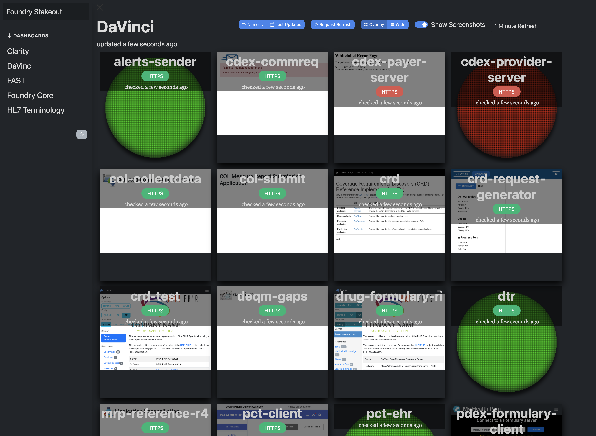
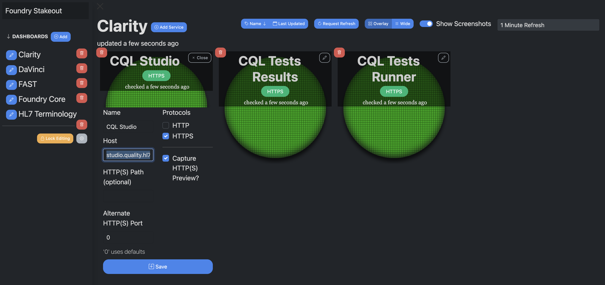

# Stakeout UI

The Stakeout UI is web-based frontend for [Stakeout Server](https://github.com/preston/stakeout-server), and requires an instance of the server to be used.

The UI provides an unauthenticated viewer interface for monitoring realtime service status and screenshots, interactive editor mode for administrators, and native browser support for light and dark themes.

## Screenshots (Dark Mode)






## Developer Quick Start

This project uses [Angular 22](https://angular.dev), [Bootstrap](https://getbootstrap.com/) for layout, and [SCSS](http://sass-lang.com) for CSS. Toast notifications use [ng-angular-popup](https://www.npmjs.com/package/ng-angular-popup). `npm` is the package manager. Use **Node 26** (see the Dockerfile).

Assuming you already have Node installed via [`nvm`](https://github.com/nvm-sh/nvm) or similar, set the following environment variables and run `npm run start`. Navigate to `http://localhost:4200/`. The app will automatically reload if you change any of the source files.

```sh
export STAKEOUT_UI_SERVER_URL=http://localhost:3000
export STAKEOUT_UI_TITLE="My Stakeout"
npm ci
npm run start
```

### Scripts

| Command | Description |
| --- | --- |
| `npm run start` | Dev server |
| `npm run build` | Production build |
| `npm test` | Unit tests (Vitest via `@angular/build:unit-test`) |

## Building for Production with Docker

To build with [Docker](https://www.docker.com) and [nginx](http://nginx.org), use the included Dockerfile, such as:

```sh
docker build --platform linux/amd64 -t p3000/stakeout-ui:latest .

# or cross-platform
docker buildx build --platform linux/arm64/v8,linux/amd64 -t p3000/stakeout-ui:latest . --push
```

## Production Deployment

In your container hosting environment, point an instance at your Stakeout Server installation:

```sh
docker run -d -p 9000:80 --restart unless-stopped \
-e "STAKEOUT_UI_SERVER_URL=http://localhost:3000" \
-e "STAKEOUT_UI_TITLE=My Stakeout" \
p3000/stakeout-ui:latest
```

# Attribution

Copyright © 2011-2026 Preston Lee. All rights reserved.

# License

Provided under the Apache 2.0 license.
